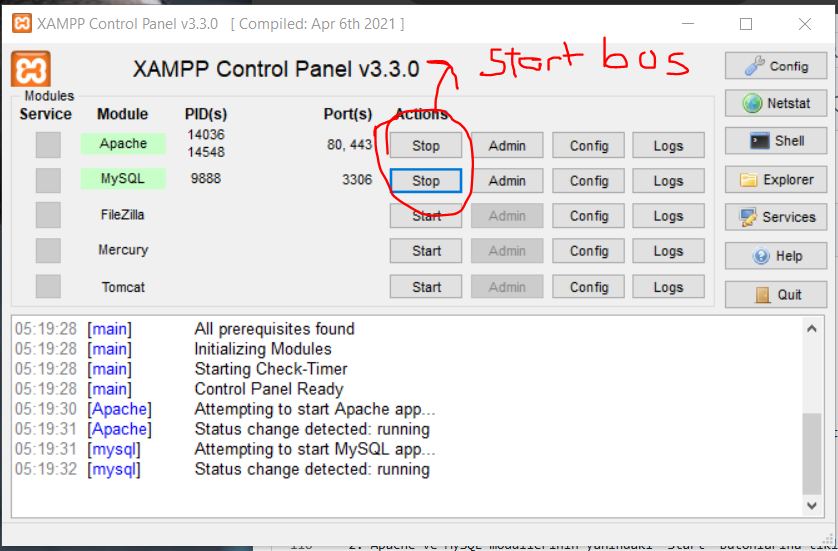
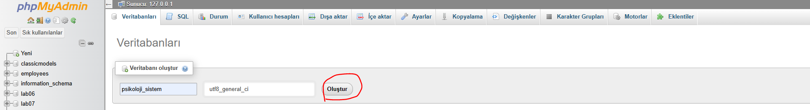
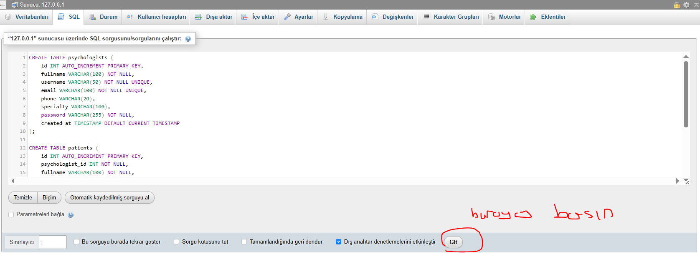
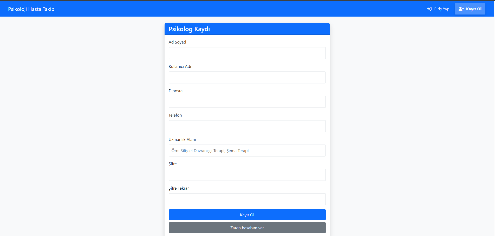
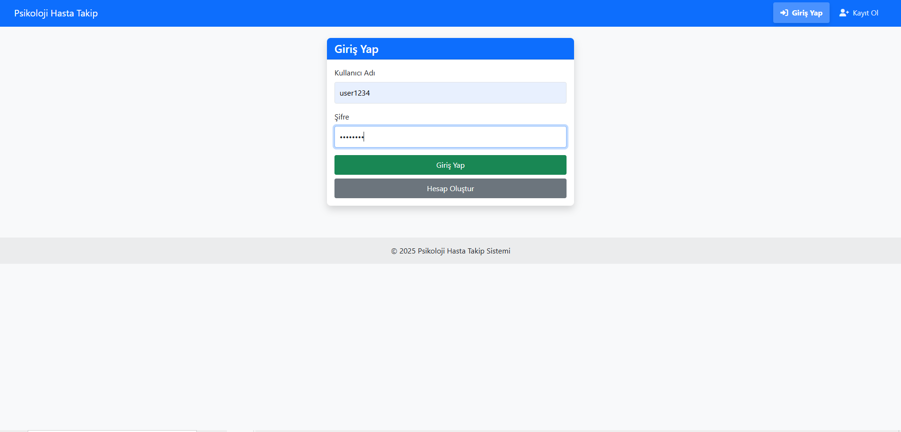
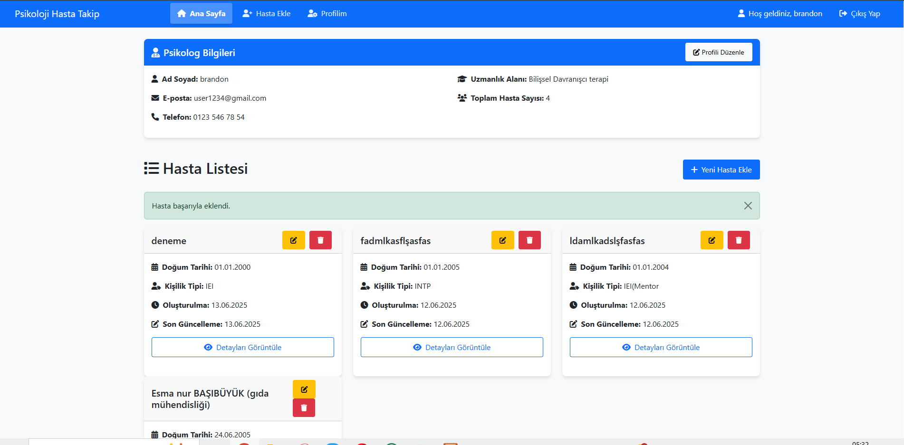
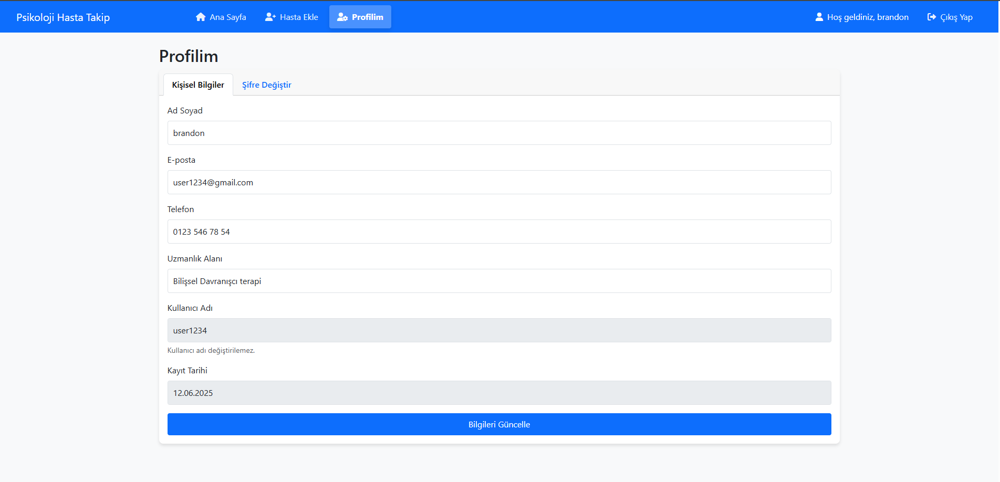

#  PsyTrack: PSYCHOLOGY  PATİENT MANAGEMENT SYSTEM

## 📋 Proje Genel Bakış

Liseden beri psikolojiye ilgili olduğum için bu projeyi seçtim.Çok fazla da önceden psikologlarla görüşme şansım oldu.Bu projeyi ders notu için yapmış olablirim ama ilerde mentorluk çalışmalarımda çok daha komplex bir site kurmayı planlıyorum.Bu arada kurulum kısmı için gerçekten uğraştım.En bilmeyen adamın bile kullanacağı şekilde.Benim için sevdiğim bir alan olduğu için eğlenceli oldu.İlerde bu projeyi psikolog-hasta gibi değilde mentor-öğrenci ilişkisiyle geliştirmeyi düşünüyorum.

Psikoloji Hasta Takip Sistemi, modern psikoloji pratiğinin karmaşık ihtiyaçlarını karşılamak için özel olarak tasarlanmış kapsamlı bir dijital çözümdür. Bu sistem, psikologların hastalarıyla ilgili kritik bilgileri organize etmelerine, tedavi süreçlerini takip etmelerine ve klinik iş akışlarını optimize etmelerine olanak tanır.Bu sayede psikolog hastanın tüm bilgilerini görsel olarak okunması kolay bir kartta görebilir.Bilgi karmaşıklığı artar.Psikologlar ,herkes bilirki her hastasının bilgilerini bir dolapta mavi dosyada saklar.Bu uygulama bunu ortadan kaldırır.Aşırı complex bir sistem inşa etmedim ama önemli olan temel default proje iskeleti.Otantikliği ve kullanışlılığı.

## 🌟 Psikologlar İçin Sunduğu Faydalar

### 📊 Hasta Verilerinin Merkezi Yönetimi

Psikoloji Hasta Takip Sistemi, tüm hasta bilgilerini tek bir güvenli platformda birleştirir:

- **Demografik Bilgiler**: Hasta kimlik bilgilerini kolayca kaydedin ve erişin
- **Kişilik Profilleri**: MBTI ve benzeri kişilik tipi sınıflandırmalarını kaydederek hastanın temel davranış eğilimlerini anlayın
- **Ara İnançlar**: Hastaların kendileri, dünya ve başkaları hakkındaki temel inançlarını belgeleyerek bilişsel davranışçı terapi süreçlerini destekleyin
- **Bilişsel Çarpıtmalar**: Hastaların düşünce süreçlerindeki çarpıtmaları tanımlayarak tedavi planlamasına yardımcı olun
- **Temel Problemler**: Ana şikayetleri ve belirtileri kayıt altına alarak tedavi odağını belirleyin

### 📈 Klinik Verimlilik Artışı

Sistem, aşağıdaki özelliklerle psikologların iş yükünü hafifletir:

- **Zaman Tasarrufu**: Manuel not tutma ve kağıt belge yönetimi ihtiyacını ortadan kaldırır
- **Hızlı Erişim**: Anlık hasta bilgi erişimi sağlayarak seans öncesi hazırlığı kolaylaştırır
- **Her Yerden Erişim**: İnternet bağlantısı olan herhangi bir cihazdan güvenli erişim sağlar
- **Kolay Güncelleme**: Seans sonrası notlar ve güncellemeler için kullanıcı dostu arayüz sunar
- **Hasta Sayısı Yönetimi**: Hasta kapasitesini takip ederek iş yükünüzü optimize edin
- **İlerleme Takibi**: Tedavi süreci boyunca hastaların ilerlemesini izleyin


### 🛡️ Veri Güvenliği ve Gizlilik

- **🔒 Şifreli Veri Saklama**: Hasta bilgileri güvenli bir şekilde saklanır
- **👤 Kullanıcı Kimlik Doğrulama**: Güçlü şifreleme ile yetkisiz erişimleri engeller   


 
### 👥 Kullanıcı Deneyimi

- **Sezgisel Arayüz**: Minimal eğitimle kolayca kullanılabilen kullanıcı dostu arayüz
- **Responsive Tasarım**: Bilgisayar, tablet ve akıllı telefonlarla uyumlu
- **Hızlı Yanıt Süresi**: Hasta bilgilerine anında erişim
- **Görev Odaklı Tasarım**: Psikologların en sık kullandığı özelliklere kolay erişim


##  ÖRNEK KULLANIM AKIŞI

1. **👩‍⚕️ Giriş ve Ana Sayfa**:
   - Psikolog, güvenli şifre ile sisteme giriş yapar
   - Ana sayfada tüm hastaların genel görünümüne erişir
   - Kendi profil bilgilerini ve hasta sayısını görür

2. **➕ Yeni Hasta Ekleme**:
   - "Yeni Hasta Ekle" butonuna tıklayarak yeni hasta formu açılır
   - Temel bilgileri (ad, doğum tarihi) ve psikolojik değerlendirmeleri (kişilik tipi, ara inançlar, bilişsel çarpıtmalar) kaydeder
   - Notlar bölümüne ilk değerlendirme bulgularını ekler

3. **🔍 Hasta Bilgilerini İnceleme**:
   - Ana sayfadaki hasta kartlarından herhangi birine tıklayarak detaylı bilgilere erişir
   - Önceki seanslara ait notları ve değerlendirmeleri inceler
   - Tedavi sürecini kapsamlı olarak görüntüler

4. **✏️ Bilgileri Güncelleme**:
   - Hasta kartındaki "Düzenle" butonuna tıklayarak bilgileri günceller
   - Yeni değerlendirmeleri ve seans notlarını ekler
   - Değişiklikleri kaydederek hasta profilini günceller

## GELECEK GELİŞTİRMELER

Sistem, aşağıdaki planlanan özelliklerle sürekli olarak geliştirilecektir:

- **📆 Randevu Yönetimi**: Entegre takvim ve randevu hatırlatıcıları
- **📊 Gelişmiş Raporlama**: İstatistiksel analizler ve grafiksel veri gösterimi
- **🔔 Bildirim Sistemi**: Önemli hasta bilgileri için otomatik hatırlatıcılar
- **📱 Mobil Uygulama**: Kullancıya istenilen yerden dosya ,video ve fotoğraf gönderme


#   Kurulum Kılavuzu

Bu kılavuz, hiç teknik bilgisi olmayan birinin bile Psikoloji Hasta Takip Sistemini kolayca kurabilmesi için adım adım talimatlar sunmaktadır.

## 📋 Kurulum Adımları

### 1️⃣ XAMPP Kurulumu (Eğer kurulu değilse)

1. [XAMPP'in resmi sitesinden](https://www.apachefriends.org/index.html) işletim sisteminize uygun XAMPP sürümünü indirin
2. İndirilen kurulum dosyasını çalıştırın ve ekrandaki talimatları izleyerek kurulumu tamamlayın
3. Kurulum tamamlandıktan sonra XAMPP Control Panel'i açın

### 2️⃣ Proje Dosyalarını İndirme ve Yerleştirme

1. GitHub'dan proje dosyalarını indirin:
   - GitHub sayfasına gidin
   - Yeşil "Code" butonuna tıklayın
   - "Download ZIP" seçeneğini tıklayarak dosyaları indirin
   
2. İndirdiğiniz ZIP dosyasını açın ve içindeki `psikoloji_sistem` klasörünü kopyalayın

3. XAMPP'in kurulu olduğu dizine gidin:
   - Windows: Genellikle `C:\xampp\htdocs`
   - macOS: Genellikle `/Applications/XAMPP/htdocs`
   - Linux: Genellikle `/opt/lampp/htdocs`

4. Kopyaladığınız `psikoloji_sistem` klasörünü `htdocs` klasörü içine yapıştırın

### 3️⃣ XAMPP Servislerini Başlatma

1. XAMPP Control Panel'i açın (Eğer açık değilse)
2. Apache ve MySQL modüllerinin yanındaki "Start" butonlarına tıklayın
3. Her iki modülün de yeşil renkte olduğundan (çalıştığından) emin olun



### 4️⃣ Veritabanı Oluşturma

1. Tarayıcınızı açın ve adres çubuğuna `http://localhost/phpmyadmin` yazıp Enter tuşuna basın
2. phpMyAdmin arayüzü açılacaktır
3. Sol taraftaki menüden "New" (Yeni) butonuna tıklayın
4. Veritabanı adı olarak `psikoloji_sistem` yazın
5. Karakter seti (collation) olarak açılır menüden `utf8_general_ci` seçin
6. "Create" (Oluştur) butonuna tıklayın



### 5️⃣ Veritabanı Tablolarını Oluşturma

1. Sol menüden yeni oluşturduğunuz `psikoloji_sistem` veritabanını seçin
2. Üst menüden "SQL" sekmesine tıklayın
3. Aşağıdaki SQL kodunu büyük metin kutusuna yapıştırın:

```sql
CREATE TABLE psychologists (
    id INT AUTO_INCREMENT PRIMARY KEY,
    fullname VARCHAR(100) NOT NULL,
    username VARCHAR(50) NOT NULL UNIQUE,
    email VARCHAR(100) NOT NULL UNIQUE,
    phone VARCHAR(20),
    specialty VARCHAR(100),
    password VARCHAR(255) NOT NULL,
    created_at TIMESTAMP DEFAULT CURRENT_TIMESTAMP
);

CREATE TABLE patients (
    id INT AUTO_INCREMENT PRIMARY KEY,
    psychologist_id INT NOT NULL,
    fullname VARCHAR(100) NOT NULL,
    birthdate DATE,
    personality_type VARCHAR(10),
    core_beliefs TEXT,
    cognitive_distortions TEXT,
    general_issues TEXT,
    notes TEXT,
    created_at TIMESTAMP DEFAULT CURRENT_TIMESTAMP,
    updated_at TIMESTAMP DEFAULT CURRENT_TIMESTAMP ON UPDATE CURRENT_TIMESTAMP,
    FOREIGN KEY (psychologist_id) REFERENCES psychologists(id)
);
```

4. "Go" (Git) butonuna tıklayın
5. "2 queries executed..." (2 sorgu çalıştırıldı...) mesajını görmelisiniz



### 6️⃣ Uygulamayı Çalıştırma

1. Tarayıcınızın adres çubuğuna `http://localhost/psikoloji_sistem/` yazın ve Enter tuşuna basın
2. Uygulama, sizi giriş sayfasına yönlendirecektir
3. Henüz bir hesabınız olmadığı için "Kayıt Ol" butonuna tıklayın
**Kayıt formunu doldurun ve "Kayıt Ol" butonuna tıklayarak ilk kullanıcınızı (psikolog) oluşturun**  



**Oluşturduğunuz hesap bilgileriyle giriş yapın**  



**Arayüzden istediğiniz gibi hasta ekleyip çıkarabilirsiniz**  



**İsterseniz kendi kişisel bilgilerinizi ve şifrenizi değiştirebilirsiniz.**  




## 🔍 Sorun Giderme

### "Sayfa Bulunamadı" Hatası
- XAMPP'in çalıştığından emin olun (Apache ve MySQL modülleri yeşil olmalı)
- Dosya yolunun doğru olduğundan emin olun (`htdocs` klasörü içinde `psikoloji_sistem` klasörü olmalı)
- Tarayıcının adres çubuğunda `http://localhost/psikoloji_sistem/` yazdığından emin olun

### Veritabanı Bağlantı Hatası
- MySQL modülünün çalıştığından emin olun
- `psikoloji_sistem` adında bir veritabanı oluşturduğunuzdan emin olun
- Veritabanı tablolarının doğru oluşturulduğundan emin olun

### "Access Denied" (Erişim Reddedildi) Hatası
- XAMPP'i yönetici olarak çalıştırmayı deneyin
- `htdocs` klasörünün okuma/yazma izinlerini kontrol edin

## 📱 Sistem Nasıl Kullanılır?

1. **Hasta Ekleme**: Ana sayfada "Yeni Hasta Ekle" butonuna tıklayarak hasta bilgilerini girebilirsiniz
2. **Hasta Görüntüleme**: Ana sayfada tüm hastalarınızın listesini görebilirsiniz
3. **Hasta Düzenleme**: Herhangi bir hastanın kartındaki düzenleme butonuna tıklayarak bilgilerini güncelleyebilirsiniz
4. **Hasta Silme**: Herhangi bir hastanın kartındaki silme butonuna tıklayarak kaydını silebilirsiniz
5. **Profil Yönetimi**: Üst menüdeki "Profilim" butonuna tıklayarak kendi bilgilerinizi düzenleyebilirsiniz

## 🎬 Video Anlatım

Daha detaylı kullanım anlatımı için [video anlatımımızı izleyebilirsiniz](https://drive.google.com/file/d/17n0pPH8JmQYU2kz6sHxNu5PvXYj--bpG/view?usp=drive_link)

---


## 📞 Daha Fazla Bilgi

<p align="center">
  <a href="https://www.instagram.com/yunusemreerk/">
    
  </a>
</p>

<p align="center">
  Sistemin özellikleri, özelleştirme seçenekleri veya diğer sorularınız için Instagram üzerinden iletişime geçebilirsiniz.
</p>

---

<p align="center">
  Psikoloji Hasta Takip Sistemi &copy; 2023 Tüm Hakları Saklıdır
</p>
